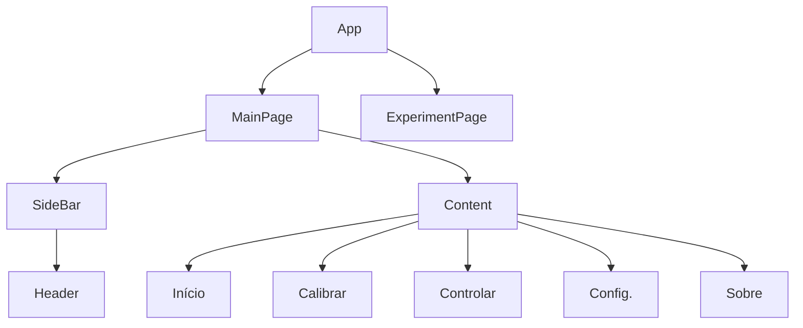

# Front End

As front end framework/library we are using [ReactJs](https://reactjs.org/).

You can check out the [about](../about/index.md#included-third-party-projects) page for a list of the **third party projects** being used.

## Styling

Stylesheets are made with `style.module.css` and imported into the `.jsx` allowing us to use it as an object to name `className`s.

As for naming convention snake case is being used for styling names

``` react
import styleModule from "./mainPage.module.css";

<div className={styleModule.my_custom_div}>
    Im a styled div
<div>

```

### Global variables

The global variables can be found at `variables.css`. You can import it into your stylesheet using

```css
@import url(./variables.css);
```

## Component architecture



