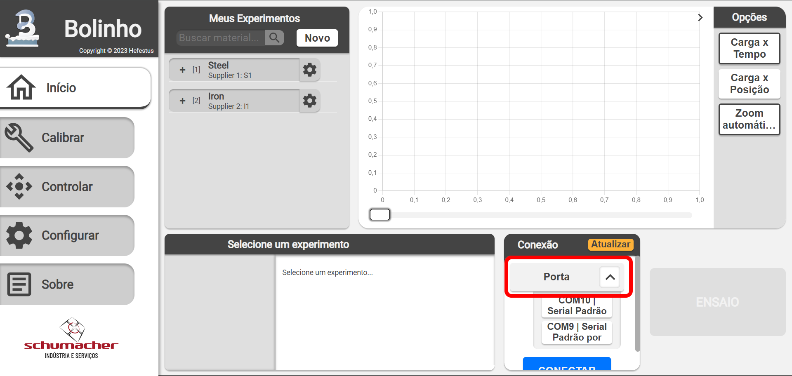
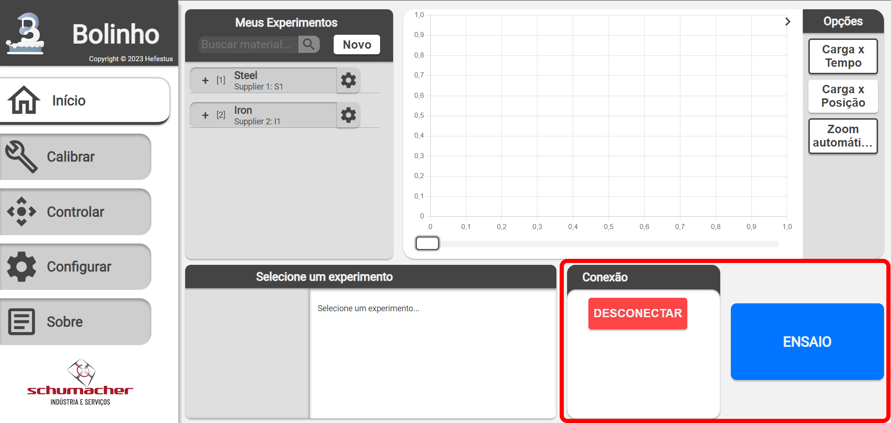
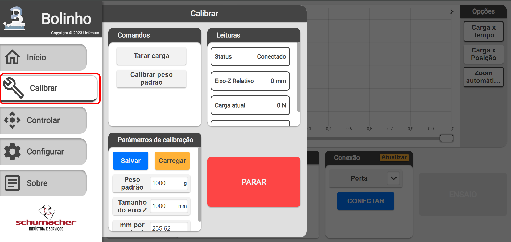

<!--
 Copyright (C) 2023 Hefestus
 
 This file is part of Bolinho.
 
 Bolinho is free software: you can redistribute it and/or modify
 it under the terms of the GNU General Public License as published by
 the Free Software Foundation, either version 3 of the License, or
 (at your option) any later version.
 
 Bolinho is distributed in the hope that it will be useful,
 but WITHOUT ANY WARRANTY; without even the implied warranty of
 MERCHANTABILITY or FITNESS FOR A PARTICULAR PURPOSE.  See the
 GNU General Public License for more details.
 
 You should have received a copy of the GNU General Public License
 along with Bolinho.  If not, see <http://www.gnu.org/licenses/>.
-->

# Calibração

Neste capitulo vamos aprender como conectar ao Granulado pela primeira vez.

Para iniciar garanta que o **Motor de passo** está **DESLIGADO** isso é de suma importância para sua segurança, como apontado no item [Alimentação](./instalacao.md#alimentacao) o motor de passo pode ser acionado independentemente do resto do Granulado.

## Conectando ao Granulado

Na tela inicial no componente `Conexão` expanda o campo `Porta` e selecione o seu **dispositivo correto**.

{ width="500" }

!!! tip "Dica"
    Caso seu dispositivo não apareça na lista você pode tentar `Atualizar` a lista de portas

Ao pressionar `Conectar` o componente de `Conexão` e o `Botão de ensaio` devem ser atualizados.

{ width="500" }

Nesse momento o Bolinho está conectado ao Granulado.

## Página `Calibrar`

Através do **menu lateral** acesse a página `Calibrar`. Você deve ser recebido com uma tela similar a:

{ width="500" }

Conhecendo os componentes:

### Componente `Comandos`

Esse componente envia alguns comandos para o Granulado executar.

* `Tarar carga`: Tara a carga para um peso especifico
    
* `Calibrar peso padrão`: Calibra a célula de carga para um peso conhecido.

### Componente `Leituras`

Esse componente apresenta as **leituras atuais** em tempo real que recebeu do Granulado.

* `Status`: Status do Granulado `Desconectado` ou `Conectado`.
    
* `Carga atual`: Carga atual na célula de carga.

* `Δ Carga atual`: Variação da carga em tempo real.

### Componente `Parâmetros de calibração`

Esse componente permite que o usuário configure os **Parâmetros de calibração** do equipamento.

### Componente `Botão de parada`

Esse componente envia um comando de **parar o motor imediatamente** ao Granulado.

!!! warning "Atenção"
    Não deve ser usado como parada de emergência, sempre esteja pronto para acionar o **Botão de emergência FÍSICO**

## Fluxos de trabalho

A seguir é apresentado um simples fluxo de trabalho de como calibrar os diferentes componentes:

### Calibrar a Célula de carga

1. Garanta que o motor de passo **Não está ativo**.
1. Instale o aparato de ensaio à célula de carga.
1. Conecte o Granulado ao Bolinho.
1. Vá a página de calibração
1. Pressione **Tarar carga**.
1. Verifique a configuração do **Peso padrão**
1. Instale o peso padrão
1. Pressione **Calibrar peso padrão**.
1. !!! success "Sucesso!"
    Sua célula de carga deve estar calibrada!

### Calibrar o Eixo-z

1. !!! danger "PERIGO"
    Garanta que você seguiu os passos de [Precauções com o motor de passo](./instalacao.md#precaucoes-com-o-motor-de-passo).
1. Conecte o Granulado ao Bolinho.
1. Ligue o motor de passo.
1. Vá para a pagina `Calibrar`
1. Insira o **Tamanho do eixo Z**
1. Vá para a pagina `Controlar`
1. Execute `1 revolução`
1. Meça quantos `mm` a máquina avançou em 1 revolução.
1. Vá para a pagina `Calibrar`
1. Insira o **mm por revolução**
1. Salve
1. !!! success "Sucesso!"
    Seu eixo-z deve estar calibrado!
