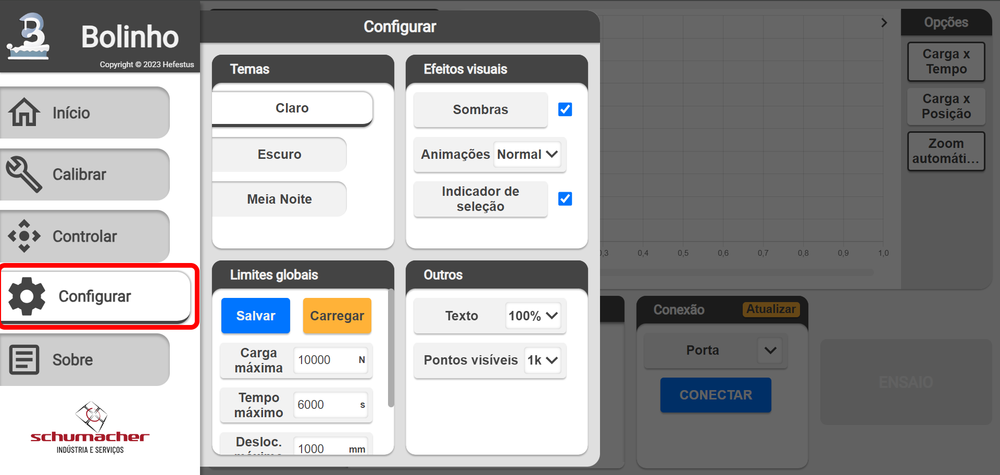
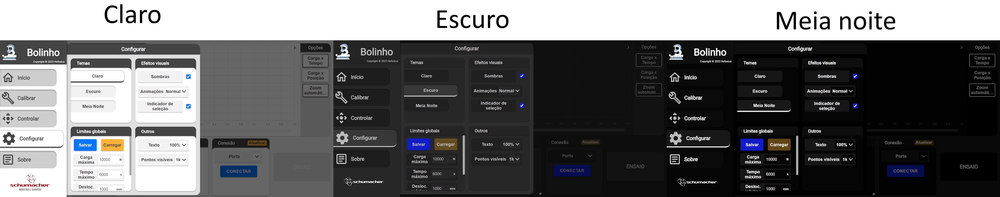

<!--
 Copyright (C) 2023 Hefestus
 
 This file is part of Bolinho.
 
 Bolinho is free software: you can redistribute it and/or modify
 it under the terms of the GNU General Public License as published by
 the Free Software Foundation, either version 3 of the License, or
 (at your option) any later version.
 
 Bolinho is distributed in the hope that it will be useful,
 but WITHOUT ANY WARRANTY; without even the implied warranty of
 MERCHANTABILITY or FITNESS FOR A PARTICULAR PURPOSE.  See the
 GNU General Public License for more details.
 
 You should have received a copy of the GNU General Public License
 along with Bolinho.  If not, see <http://www.gnu.org/licenses/>.
-->

# Configuração

Este capitulo apresentará as informações de como configurar os diferentes componentes do Bolinho.

A página de configurações é acessada através do menu lateral

{ width="500" }

## Temas

O componente `Temas` permite que o usuário modifique a apresentação da interface gráfica

## Efeitos visuais

O componente `Efeitos visuais` controla artificios extras da interface, os diferentes efeitos possuem um **impacto na performance**.

* `Sombras`: Ativa ou desativa sombras
    
    > Desativar as sombras pode melhorar a performance da interface.

* `Animações`: Modifica a velocidade das animações
    * `Rápido`: Velocidade rápida das animações.
    * `Normal`: Velocidade padrão das animações.
    * `Desligado`: Desativa as animações.
    > Desativar as animações pode melhorar a performance da interface.

* `Indicador de seleção`: Ativa ou desativa o indicador de seleção ao passar o mouse por cima.
    
    > Desativa-lo melhora a visualização em dispositivos *touch screen*.

## Limites globais

Configura os **limites globais** da aplicação. Durante a criação de um experimento os limites de parada não poderão exceder os globais.

!!! danger "Área perigosa"
    É importante que os **limites globais** sejam configurados propriamente para que não possam ser criados experimentos excedam os limites operacionais de seu maquinário.

## Outros
* `Texto`: Modifica o tamanho do texto da interface.

* `Pontos visíveis`: Modifica o numero de pontos visíveis durante a inspeção de um experimento. Essa configuração determina a **precisão de visualização** ou seja, quanto maior maior será a precisão com o zoom afastado, entretanto ao dar zoom em um experimento sua **precisão** será melhorada automaticamente.

    > Recomendamos deixar no padrão de ``1k pontos`` ou diminuir para ``500 pontos`` caso a performance esteja baixa.