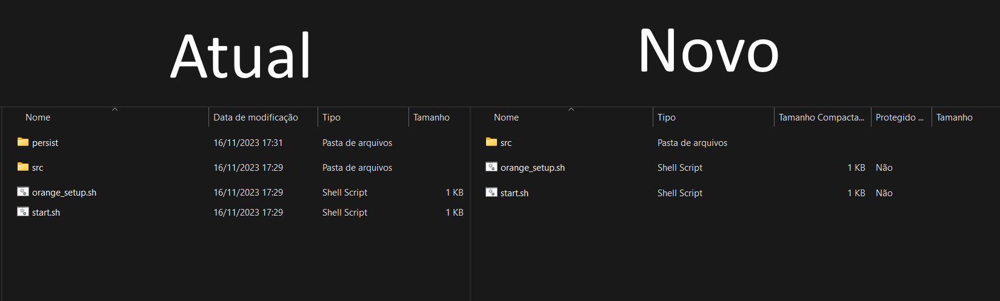

<!--
 Copyright (C) 2023 Hefestus
 
 This file is part of Bolinho.
 
 Bolinho is free software: you can redistribute it and/or modify
 it under the terms of the GNU General Public License as published by
 the Free Software Foundation, either version 3 of the License, or
 (at your option) any later version.
 
 Bolinho is distributed in the hope that it will be useful,
 but WITHOUT ANY WARRANTY; without even the implied warranty of
 MERCHANTABILITY or FITNESS FOR A PARTICULAR PURPOSE.  See the
 GNU General Public License for more details.
 
 You should have received a copy of the GNU General Public License
 along with Bolinho.  If not, see <http://www.gnu.org/licenses/>.
-->

# Configuração

Este capitulo apresentará as informações de como configurar esse software.

## Estrutura do programa

A imagem a seguir apresenta a estrutura de arquivos do programa:
{ width="500" }

* `src`: Contém os arquivos da aplicação, esse não deve ser alterado diretamente pelo usuário.
* `persist`: Contém os dados gerados pelo uso
    * `configParams.json`: Contém os parâmetros de configuração globais da aplicação, não é recomendado que o usuário os modifique manualmente.
    * `bolinho.db`: É o **banco de dados** da aplicação, aqui são guardados todos os dados gerados por experimentos, materiais etc. É de suma importância que o usuário mantenha uma cópia desse arquivo para proteger contra percas.
* `start.sh`: É o script de inicialização da aplicação. Esse arquivo deve ser executado para iniciar a aplicação.
* `orange_setup.sh`: Baixa todas as dependências e realiza o setup da aplicação. Esse script deve ser executado ao instalar uma versão nova do Bolinho.

## Instalando o Bolinho pela primeira vez

O software Bolinho é distribuído através de um arquivo `.zip`. Com o seguinte nome `Bolinho_[versão].zip` por exemplo `Bolinho_178.zip`.

1. Extraia o arquivo.
2. Copie o arquivo `Bolinho` para sua `Área de trabalho`.
3. Execute o script `orange_setup.sh`.

Com isso seu programa deve estar instalado com todas suas dependências.

## Executando o Bolinho

Para utilizar o Bolinho execute o script `start.sh`.

Você deve ser recebido com uma tela como essa:

{ width="500" }

## Conectando o Granulado

O primeiro passo para configurar o granulado é ligar seus periféricos de acordo com a seguinte sequência:

{ width="500" }

Após isso conecte o **USB** e os **Sensores de Fim de Curso**.

!!! warning "Atenção"
    Preste atenção à ordem dos sensores de fim de curso, sendo 
    * `T`: Sensor **superior**.
    * `B`: Sensor **inferior**.

A comunicação do Granulado com o Bolinho é feita via USB, portanto conecte-o a uma das portas USB do `host`.

## Como atualizar o bolinho

Antes de atualizar o Bolinho é de suma importância que seja criado **uma CÓPIA do `persist`** para prevenir que a atualização corrompa seus dados.  

Note que a versão mais nova não possui o diretório `persist`.

Para atualizar o Bolinho basta copiar **todos** os arquivos da `nova` versão para os da `atual`.