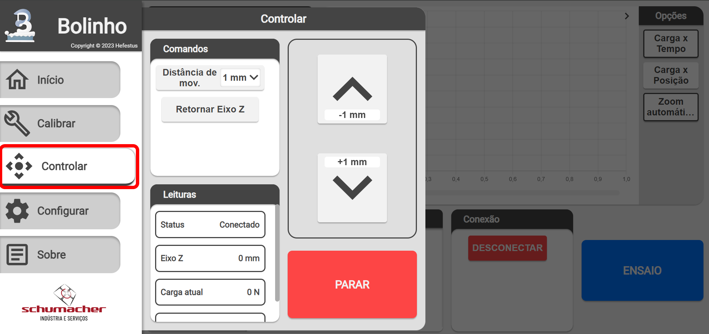

<!--
 Copyright (C) 2023 Hefestus
 
 This file is part of Bolinho.
 
 Bolinho is free software: you can redistribute it and/or modify
 it under the terms of the GNU General Public License as published by
 the Free Software Foundation, either version 3 of the License, or
 (at your option) any later version.
 
 Bolinho is distributed in the hope that it will be useful,
 but WITHOUT ANY WARRANTY; without even the implied warranty of
 MERCHANTABILITY or FITNESS FOR A PARTICULAR PURPOSE.  See the
 GNU General Public License for more details.
 
 You should have received a copy of the GNU General Public License
 along with Bolinho.  If not, see <http://www.gnu.org/licenses/>.
-->

# Controle manual

Este capitulo discutirá como controlar o maquinário manualmente. Essa função é importante para posicionar a célula de carga na posição correta para iniciar um experimento.

## Ativando o motor
Primeiro conecte o Granulado ao Bolinho, vide: [Instalando o Granulado](./instalacao.md#instalando-o-granulado) e [Conectando ao Granulado](./calibracao.md#conectando-ao-granulado).

!!! danger "PERIGO"
    Garanta que você seguiu os passos de [Precauções com o motor de passo](./instalacao.md#precaucoes-com-o-motor-de-passo).

Após garantir que o Granulado está conectado e que as **precauções de segurança** foram tomadas **Ative o motor de carga**.

Nesse momento o motor **Não deve estar fazendo um ruído continuo**.

!!! info
    A velocidade padrão do motor durante controle manual é de `15 RPM`.

## Página `Controlar`

Através do **menu lateral** acesse a página `Controlar`. Você deve ser recebido com uma tela similar a:

{ width="500" }

Conhecendo os componentes:

### Componente `Comandos`

* `Distância de Movimento`: Modifica a distância de movimento. Esse é setado ou em `mm` (Milímetros) ou em `REV` (Revoluções).
    
!!! tip "Dica"
        Utilize o `REV` para encontrar a quantidade de **mm por revolução** necessário para calibração do eixo-z.

* `Retornar Eixo-Z`: Retorna o eixo-z ao ponto superior.

### Componente `Leituras`

Esse componente apresenta as **leituras atuais** em tempo real que recebeu do Granulado.

Ver [Componente `Leituras`](./calibracao.md#componente-leituras)

### Componente `Controle`

Envia o comando para o motor mover em `Distância de Movimento`.

### Componente `Botão de parada`

Esse componente envia um comando de **parar o motor imediatamente** ao Granulado.

!!! warning "Atenção"
    Não deve ser usado como parada de emergência, sempre esteja pronto para acionar o **Botão de emergência FÍSICO**
