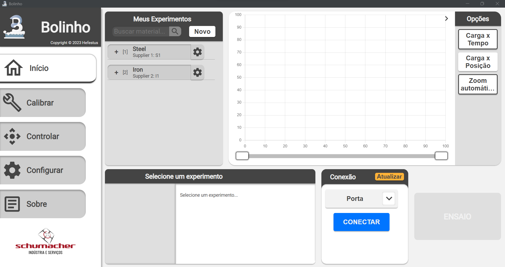

<!--
 Copyright (C) 2023 Hefestus
 
 This file is part of Bolinho.
 
 Bolinho is free software: you can redistribute it and/or modify
 it under the terms of the GNU General Public License as published by
 the Free Software Foundation, either version 3 of the License, or
 (at your option) any later version.
 
 Bolinho is distributed in the hope that it will be useful,
 but WITHOUT ANY WARRANTY; without even the implied warranty of
 MERCHANTABILITY or FITNESS FOR A PARTICULAR PURPOSE.  See the
 GNU General Public License for more details.
 
 You should have received a copy of the GNU General Public License
 along with Bolinho.  If not, see <http://www.gnu.org/licenses/>.
-->

# Manual do usuário

Aqui você encontrará o manual do usuário de todo o sistema do **Bolinho**.

## Conhecendo os componentes

O sistema Bolinho é composto por dois componentes diferentes, o **Bolinho** e o **Granulado**

### Bolinho 

Bolinho é a **interface humana** responsável por orquestrar todo o funcionamento do sistema Bolinho.

Bolinho é uma aplicação padrão de computador, e atualmente suporta apenas Linux como seu sistema operacional.

!!! info
    Bolinho foi testado na distribuição [Debian da OrangePI](http://www.orangepi.org/html/hardWare/computerAndMicrocontrollers/service-and-support/Orange-Pi-PC.html) no hardware [OrangePI 5 8Gb RAM](http://www.orangepi.org/html/hardWare/computerAndMicrocontrollers/details/Orange-Pi-5.html)

Para informações sobre a sua configuração visite a página [Manual do usuário - configuração](configuracao.md).

O repositório com o código fonte do bolinho pode ser encontrado em <https://github.com/HefestusTec/bolinho> junto com sua documentação.

### Granulado 

Granulado é o *firmware* embarcado do sistema, este é responsável pela interface com o *hardware* e seu *driver*.

O *firmware* foi escrito para atuar no [ESP32-S3](https://www.espressif.com/en/products/socs/esp32-s3) e utiliza um USB para sua comunicação serial com o Bolinho. Mais informações especificas sobre o embarcado podem ser encontradas em [embedded](../embedded/index.md).

Para informações sobre a sua configuração visite a página [Manual do usuário - configuração](configuracao.md).

O repositório com o código fonte do bolinho pode ser encontrado em <https://github.com/HefestusTec/granulado>.

## Sobre a documentação

A documentação é uma coleção completa de todas as informações pertinentes ao sistema Bolinho. Ela está escrita predominantemente em **Inglês** e possui o tópico **Manual do Usuário** escrito em **Português**.

Toda a documentação do Bolinho está disponível em dois formatos `Página estática` e `PDF`

!!! warning "Atenção"
    A Hefestus não se compromete em manter os arquivos relacionados a documentação acessiveis, caso deseje mantê-los você pode fazer uma cópia local de toda a documentação

### Página estática

**O que são?** Paginas estáticas são páginas que podem ser abertas diretamente sem a necessidade de um servidor para servi-las, entretanto caso você queira também pode servi-la VOCÊ MESMO! Isso garante que todo o conteúdo será somente acessível a você / empresa.

!!! warning "Atenção"
    Algumas ferramentas como por exemplo a busca, apenas estão disponíveis se a página estiver sendo servida.

**Quais os benefícios?** Páginas estáticas permitem diferentes funcionalidades, não ficando restringido a um formato de folha de papel, e por se tratar de uma página minimamente responsiva permite que todo o trabalho de renderizar os conteúdos sejam feitos no momento de compilação do código.

**Onde encontro os arquivos?** Os arquivos relacionados a página estática podem ser encontrados na *branch* [gh-pages](https://github.com/HefestusTec/bolinho/tree/gh-pages) do repositório do Bolinho.

**Como rodar?** Para ver os conteúdos de uma página estática basta abrir o arquivo `index.html` encontrado na *root* do diretório com seu navegador de preferência! Ex.: [Google Chrome](https://www.google.com/intl/pt-BR/chrome/), [Microsoft Edge](https://www.microsoft.com/pt-br/edge), [Firefox](https://www.mozilla.org/pt-BR/firefox/browsers/) etc.

### PDF
Esta documentação também gera automaticamente uma versão em PDF, o qual você poderá usar para compatibilidade retroativa com sua documentação já existente!

O PDF pode ser encontrado [aqui](https://github.com/HefestusTec/bolinho/blob/gh-pages/pdf/document.pdf)

!!! warning "Atenção"
    Talvez esse link não esteja mais disponível por isso mantenha uma cópia do PDF localmente.
