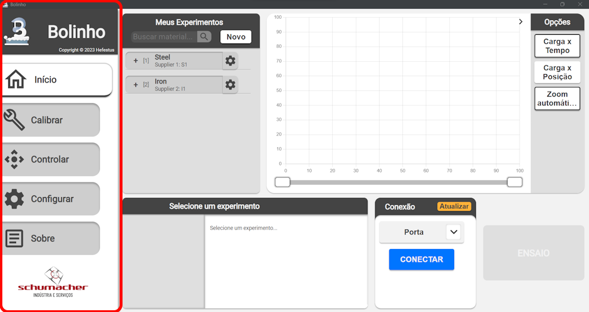
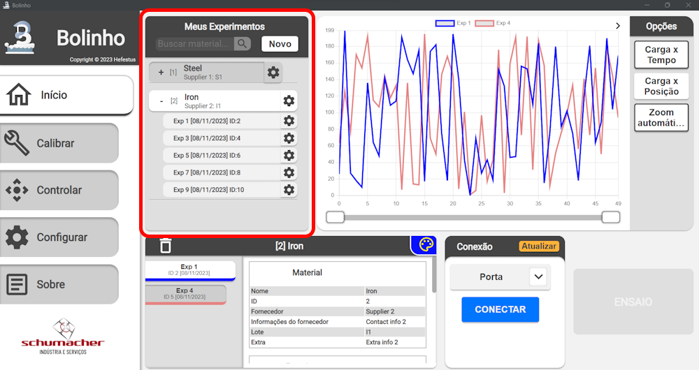
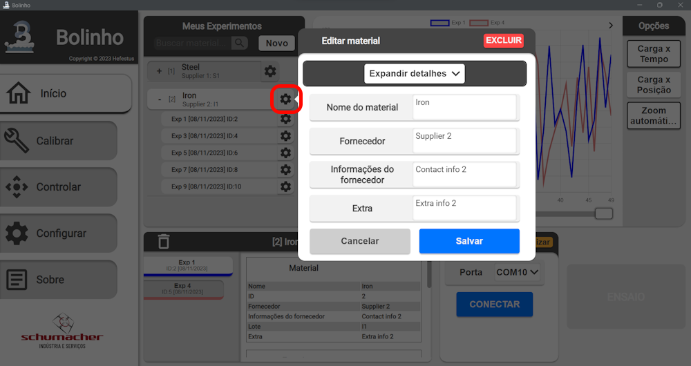
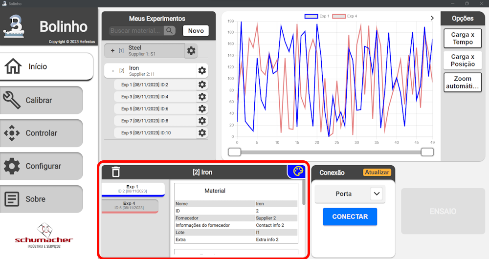
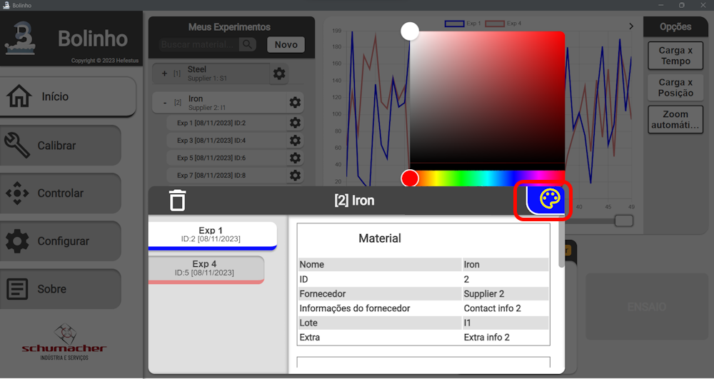
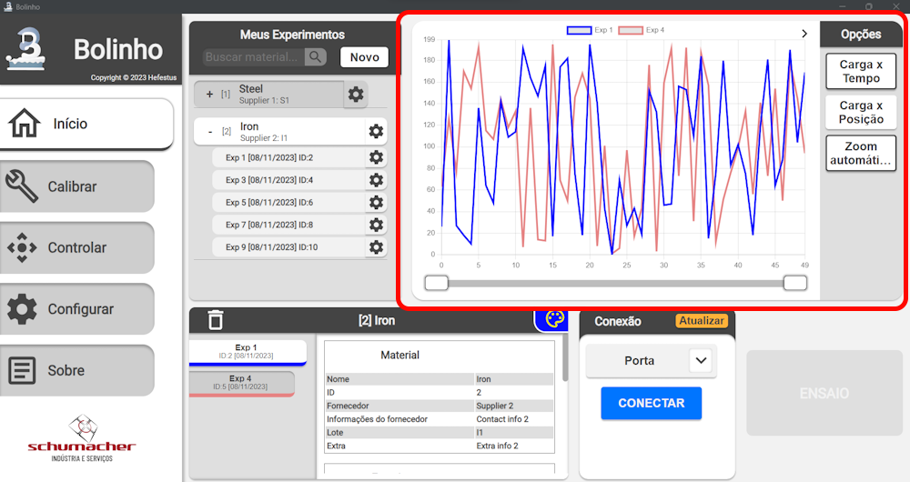
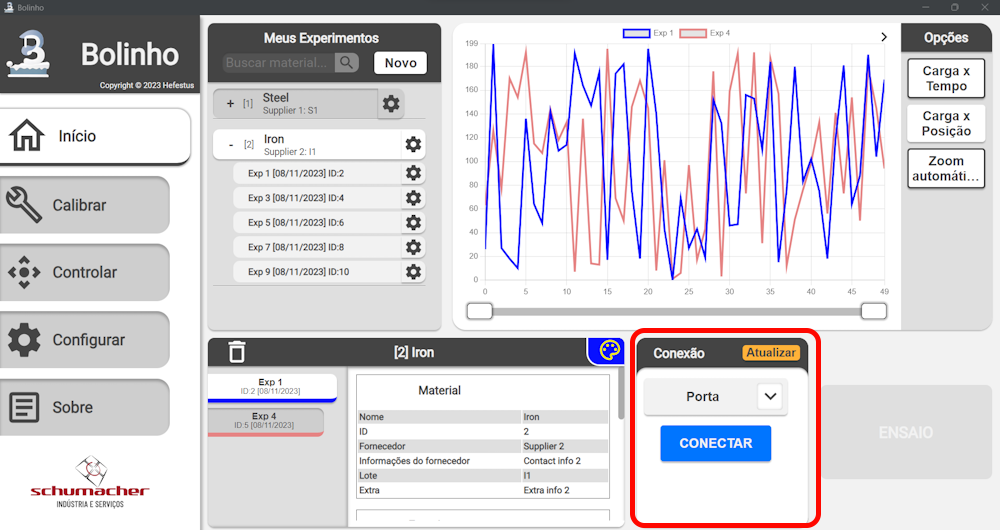
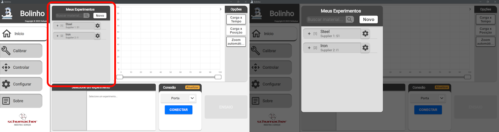

<!--
 Copyright (C) 2023 Hefestus
 
 This file is part of Bolinho.
 
 Bolinho is free software: you can redistribute it and/or modify
 it under the terms of the GNU General Public License as published by
 the Free Software Foundation, either version 3 of the License, or
 (at your option) any later version.
 
 Bolinho is distributed in the hope that it will be useful,
 but WITHOUT ANY WARRANTY; without even the implied warranty of
 MERCHANTABILITY or FITNESS FOR A PARTICULAR PURPOSE.  See the
 GNU General Public License for more details.
 
 You should have received a copy of the GNU General Public License
 along with Bolinho.  If not, see <http://www.gnu.org/licenses/>.
-->

# Inspecionando

Bem vindo a seção `Inspecionando` da documentação do Bolinho. Aqui você encontrará uma introdução à interface do Bolinho assim como as informações necessárias para inspecionar um experimento já realizado.

## Conhecendo os componentes

### Menu

{ width="500" }

O menu permite que você navegue pelas diferentes páginas do aplicativo.

___

### Seletor de experimentos

{ width="500" }

No seletor de experimentos os experimentos são organizados por seus materiais.

Você pode utilizar a **Barra de pesquisa** para filtrar os diferentes **materiais**.

Ao expandir um **material** todos os experimentos relacionados a ele serão apresentados.

Você tambem pode abrir o **dialogo de configuração** de seus **materiais** e **experimentos** para editar e revisar suas informações.

{ width="500" }

!!! info
    Alguns parâmetros de seus **experimentos** e **materiais** não são editáveis em função de manter sua **integridade de dados**.

___

### Inspetor de experimento

{ width="500" }

O **Inspetor de experimento** apresenta todos os **experimentos selecionados** e suas informações, aqui você pode encontrar dados sobre o tipo de corpo do experiment, material e mais.

Você pode **alterar a cor de plot** de um experimento aqui:
{ width="500" }

___

### Plot de experimentos

{ width="500" }

O **Plot de experimentos** apresenta para você os dados coletados em seu experimento.

A barra horizontal encontrada na parte inferior do componente permite que você navegue o experimento e aumente os detalhes em determinado ponto de interesse.

À direita está localizado a barra de opções com os seguintes botões:

* ``Carga X Tempo``: Apresenta o gráfico da carga em função do Tempo.
* ``Carga X Posição``: Apresenta o gráfico da carga em função da Posição.
* ``Zoom automático``: Restitui o **zoom** para a posição inicial, durante um experimento essa função também acompanha a criação de novos pontos de dado.  

A barra de opções também pode ser **minimizada** ao apertar a seta indicadora no canto superior direito.

___ 

### Componente de conexão

{ width="500" }

O **Componente de conexão** permite que você conecte o Granulado ao Bolinho.

O seletor `Porta` apresentará todas as portas disponíveis ao Bolinho naquele momento. Caso o dispositivo de interesse não esteja aparecendo você poder pressionar `Atualizar` para que o Bolinho recupere os dispositivos conectados mais recentes. 

___

## Funcionalidades básicas

A maioria dos softwares do bolinho possuem a capacidade de expandir. Para expandir um componente basta pressiona-lo por `zoomDelay`, por padrão esse valor é setado em `500ms`.

