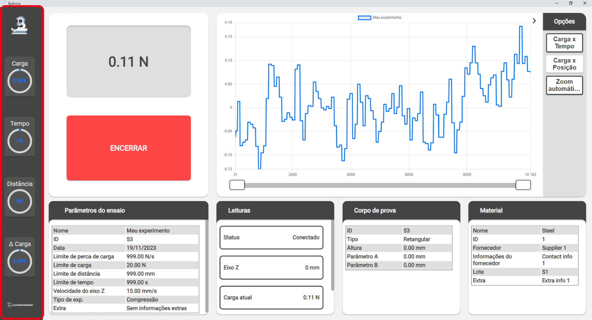
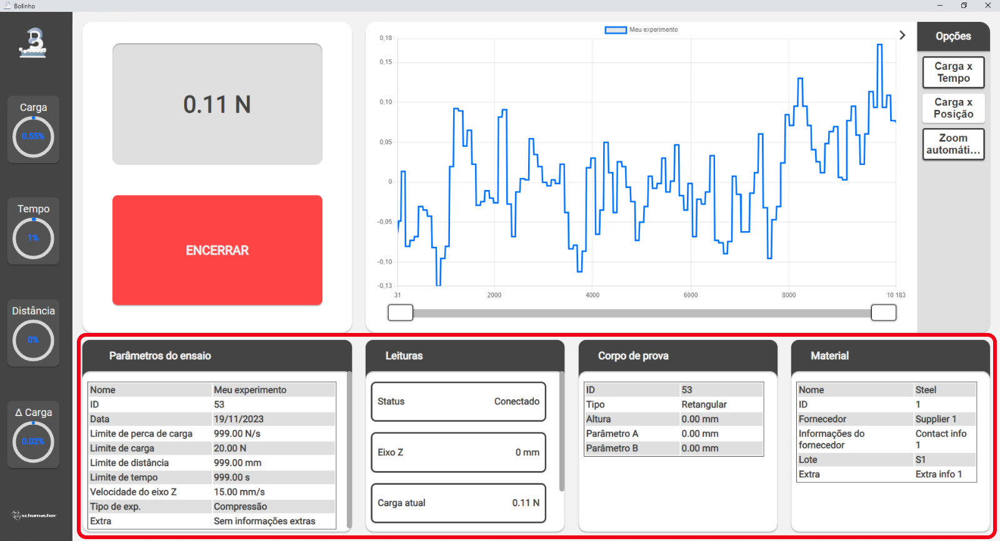
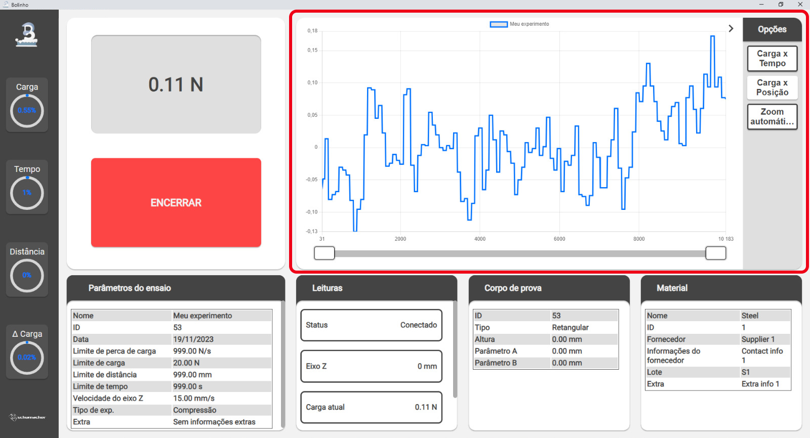

<!--
 Copyright (C) 2023 Hefestus
 
 This file is part of Bolinho.
 
 Bolinho is free software: you can redistribute it and/or modify
 it under the terms of the GNU General Public License as published by
 the Free Software Foundation, either version 3 of the License, or
 (at your option) any later version.
 
 Bolinho is distributed in the hope that it will be useful,
 but WITHOUT ANY WARRANTY; without even the implied warranty of
 MERCHANTABILITY or FITNESS FOR A PARTICULAR PURPOSE.  See the
 GNU General Public License for more details.
 
 You should have received a copy of the GNU General Public License
 along with Bolinho.  If not, see <http://www.gnu.org/licenses/>.
-->

# Novo experimento

Como criar um novo experimento.

## Criando um material novo

!!! info
    Esse passo é opcional, para caso deseje criar um novo material. Caso queira executar um experimento para um material que **já existe** pode pular essa parte.

Pressione o botão `Novo` no componente **Seletor de experimentos**

{ width="500" }

Ao pressionar o  você será apresentado o seguinte prompt de **Criação de Material**

{ width="500" }

Preencha com os dados de seu material e pressione `Criar`.

## Iniciando experimento

Ao pressionar no `Botão de ensaio` a página de **Criação de experimento** aparecerá. Você deve preenche-la **atentamente**.

!!! tip "Dica"
    Um **experimento bem configurado** é aquele que inicia e finaliza **automaticamente** sem intervenção do operador, ou seja, aquele que os `Limites de parada` estão bem configurados.

!!! danger "Perigo"
    Atente-se ao configurar a `Velocidade máxima`, valores muito altos podem **DANIFICAR O EQUIPAMENTO** e colocar a segurança do operador em risco.

### Checagem de limites
Ao finalizar a configuração de seu experimento algumas checagens serão feitas automaticamente para minimizar erros de operação:

* **Check de carga**: O experimento não será iniciado se a carga atual for **maior que** `10N`, isso busca garantir que a célula de carga foi **tarada** antes de iniciar o experimento.

* **Check de limites globais**: O experimento não será iniciado se qualquer um dos **parâmetros do experimento** como `Limite de carga`, `Limite de distância` etc. for **maior que** o seu respectivo [**Limite global**](./configuracao.md#limites-globais).

## Durante o experimento

Ao iniciar um experimento você será redirecionado à `Pagina de experimento`. Os dados dessa página são atualizados à uma taxa de aproximadamente `2hz` para poder **alocar mais recursos ao experimento**.

!!! note "Nota"
    A taxa de amostragem do experimento é bem maior que a de atualização da interface.

{ width="500" }

A `Pagina de experimento` é composta por alguns componentes:

### Barra lateral

A barra lateral apresenta para o usuário duas informações:

* **Circulo externo**: Apresenta a porcentagem daquele valor em relação a **seu limite**, ou seja ao completar significa que esse limite foi atingido e o experimento se encerará. 

* **Valor interno**: Apresenta o valor atual daquele dado. 

{ width="500" }

### Dados do experimento

No canto inferior são encontrados os diversos dados do experimento atual.

{ width="500" }

### Visor

O visor apresenta a leitura atual da célula e o `Botão de encerrar`.

!!!tip "Dica"
    Como apresentado em [Iniciando experimento](./novo_experimento.md#iniciando-experimento), um experimento bem configurado **nunca precisará que o operador encerre manualmente**. 

{ width="500" }

### Plot em tempo real

Por fim temos o Plot em tempo real, ele conta com as mesmas funcionalidades que o [Plot de experimentos - Inspecionando](./inspecionando.md#plot-de-experimentos).

{ width="500" }

!!! note "Nota"
    Durante um experimento o plot de dados deve ser lido apenas como uma **sugestão**, já que enquanto um experimento está sendo executado a **quantidade de pontos apresentados no gráfico é reduzido** para poder alocar mais recursos ao experimento em si.

## Após o experimento

Ao finalizar um experimento seus dados serão **salvos ao banco de dados** automaticamente.

!!! warning "Atenção"
    **NÃO** encerre o Bolinho durante a escrita ao banco de dados, isso pode **corromper** seus dados.