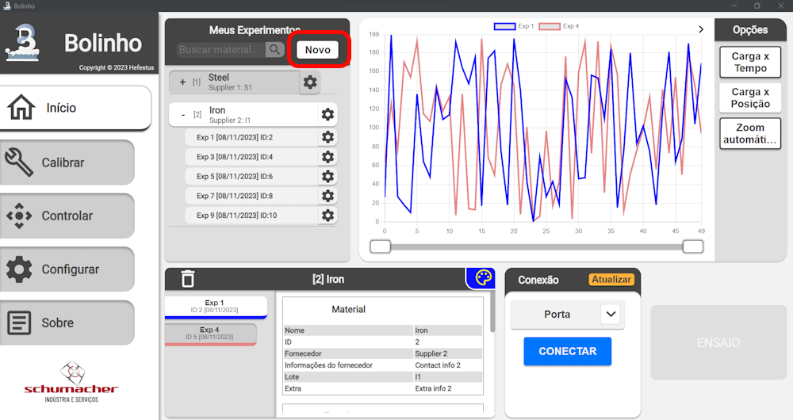
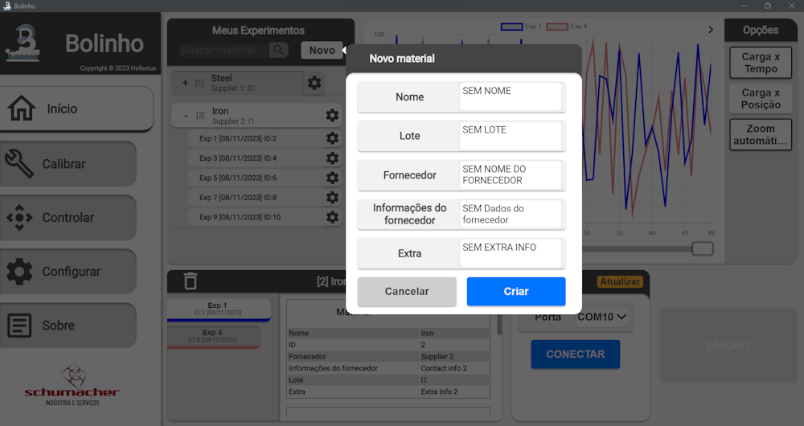

<!--
 Copyright (C) 2023 Hefestus
 
 This file is part of Bolinho.
 
 Bolinho is free software: you can redistribute it and/or modify
 it under the terms of the GNU General Public License as published by
 the Free Software Foundation, either version 3 of the License, or
 (at your option) any later version.
 
 Bolinho is distributed in the hope that it will be useful,
 but WITHOUT ANY WARRANTY; without even the implied warranty of
 MERCHANTABILITY or FITNESS FOR A PARTICULAR PURPOSE.  See the
 GNU General Public License for more details.
 
 You should have received a copy of the GNU General Public License
 along with Bolinho.  If not, see <http://www.gnu.org/licenses/>.
-->

# Novo experimento

Como criar um novo experimento.

## Criando um material novo

Pressione o botão `Novo` no componente **Seletor de experimentos**

{ width="500" }

Ao pressionar o  você será apresentado o seguinte prompt de **Criação de Material**

{ width="500" }

Preencha com os dados de seu material e pressione `Criar`.

!!! note
    Durante um experimento o plote de dados deve ser lido apenas como uma **sugestão** do resultado, já que enquanto um experimento está sendo executado a **quantidade de pontos apresentados no gráfico é reduzido** para poder alocar mais recursos ao experimento em si.